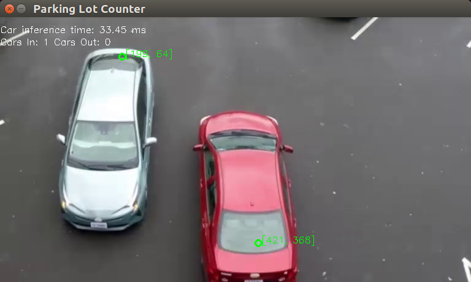
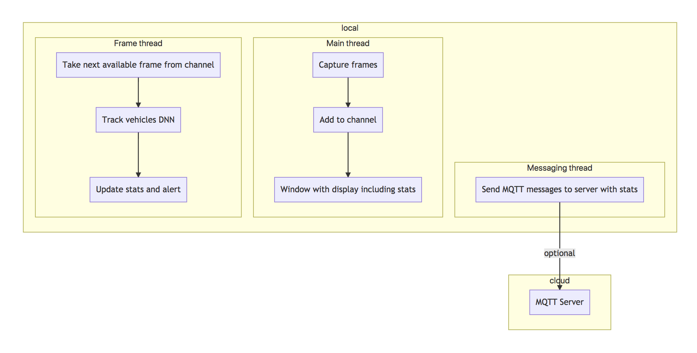

# Parking Lot Counter

| Details            |              |
|-----------------------|---------------|
| Target OS:            |  Ubuntu\* 16.04 LTS   |
| Programming Language: |  Go |
| Time to Complete:     |  45 min     |



## Introduction

This parking lot counter application is one of a series of reference implementations for Computer Vision (CV) using the Intel® Distribution of OpenVINO™ toolkit written in the Go programming language. This application is designed for a parking space area mounted camera which counts available parking space by tracking the number of vehicles entering and leaving the parking space area.

## Requirements

### Hardware

* 6th Generation Intel® Core™ processor with Intel® Iris® Pro graphics and Intel® HD Graphics

### Software

* [Ubuntu\* 16.04 LTS](http://releases.ubuntu.com/16.04/)
*Note*: You must be running kernel version 4.7+ to use this software. We recommend using a 4.14+ kernel to use this software. Run the following command to determine your kernel version:

```shell
uname -a
```

* OpenCL™ Runtime Package
* Intel® Distribution of OpenVINO™ toolkit
* Go programming language v1.11+

## Setup

### Install OpenVINO™ Toolkit

Refer to https://software.intel.com/en-us/articles/OpenVINO-Install-Linux for more information about how to install and setup the Intel® Distribution of OpenVINO™ toolkit.

You will need the OpenCL™ Runtime package if you plan to run inference on the GPU as shown by the
instructions below. It is not mandatory for CPU inference.

### Install Go

You must install the Go programming language version 1.11+ in order to compile this application. You can obtain the latest compiler from the Go website's download page at https://golang.org/dl/

For an excellent introduction to the Go programming language, check out the online tour at https://tour.golang.org

### Download the reference platform code using "go get"

You can download the reference platform code onto your computer by using the following Go command:

```shell
go get -d github.com/intel-iot-devkit/parking-lot-counter-go
```

Then, change the current directory to where you have installed the application code to continue the installation steps:

```shell
cd $GOPATH/src/github.com/intel-iot-devkit/parking-lot-counter-go
```

### Install Dep

This sample uses the `dep` dependency tool for Go. You can download and install it by running the following command:

```shell
make godep

```

### Install GoCV

Once you have installed Go, you must also install the GoCV (https://gocv.io/) package which contains the Go programming language wrappers for OpenVINO, and the associated dependencies. The easiest way to do this is by using the `dep` tool, which will satisfy the program's dependencies as defined in `Gopkg.lock` file. Run the following make file task to do so:

```shell
make dep
```

Now you should be ready to build and run the reference platform application code.

## How it Works

The application uses a video source, such as a camera, to grab frames, and then uses a Deep Neural Network (DNNs) to process the data. The network detects vehicles in the frame, and then if successful it tracks the vehicles leaving and entering the parking area adjusting the counts of the vehicles in the parking area thus providing the information about the available parking spaces.

The data can then optionally be sent to a MQTT machine to machine messaging server, as part of a parking space data analytics system.

The DNN model used in this application is an Intel® optimized models that is part of the Intel® Distribution of OpenVINO™ toolkit.

You can find it here:

- `/opt/intel/computer_vision_sdk/deployment_tools/intel_models/pedestrian-and-vehicle-detector-adas-0001`



The program creates three goroutines for concurrency:

- Main goroutine that performs the video i/o
- Worker goroutine that processes video frames
- Worker goroutine that publishes MQTT messages to remote server

## Setting the Build Environment

You must configure the environment to use the Intel® Distribution of OpenVINO™ toolkit one time per session by running the following command:

```shell
source /opt/intel/computer_vision_sdk/bin/setupvars.sh
```

## Building the Code

Start by changing the current directory to wherever you have git cloned the application code. For example:

```shell
cd $GOPATH/src/github.com/intel-iot-devkit/parking-lot-counter-go
```

Before you can build the program you need to fetch its dependencies. You can do that by running the commands below. The first one fetches `Go` depedency manager of our choice and the latter uses it to satisfy the program's depdencies as defined in `Gopkg.lock` file:

```shell
make godep
make dep
```

Once you have fetched the dependencies you must export a few environment variables required to build the library from the fetched dependencies. Run the following command from the project directory:

```shell
source vendor/gocv.io/x/gocv/openvino/env.sh
```

Now you are ready to build the program binary. The project ships a simple `Makefile` which makes building the program easy by invoking the `build` task from the project root as follows:

```shell
make build
```

This commands creates a new directory called `build` in your current working directory and places the newly built binary called `counter` into it. Once the commands are finished, you should have built the `counter` application executable.

## Running the Code

To see a list of the various options:

```shell
./counter -help
```

To run the application with the needed model using the webcam:

```shell
./counter -model=/opt/intel/computer_vision_sdk/deployment_tools/intel_models/pedestrian-and-vehicle-detector-adas-0001/FP32/pedestrian-and-vehicle-detector-adas-0001.bin -model-config=/opt/intel/computer_vision_sdk/deployment_tools/intel_models/pedestrian-and-vehicle-detector-adas-0001/FP32/pedestrian-and-vehicle-detector-adas-0001.xml
```

To control the position of the parking entrance/exit use the `-entrance, -e` command line flag, like this:

```shell
./counter -model=/opt/intel/computer_vision_sdk/deployment_tools/intel_models/pedestrian-and-vehicle-detector-adas-0001/FP32/pedestrian-and-vehicle-detector-adas-0001.bin -model-config=/opt/intel/computer_vision_sdk/deployment_tools/intel_models/pedestrian-and-vehicle-detector-adas-0001/FP32/pedestrian-and-vehicle-detector-adas-0001.xml -entrance="b"
```

The `-entrance` flag controls which part of the video stream frame is to be used for counting the cars entering and exiting the parking lot:

* `"b"`: bottom
* `"l"`: left
* `"r"`: right
* `"t"`: top

To control the car detection DNN confidence level use the `-model-confidence` flag eg. `-model-confidence=0.6` will track all cars whose DNN detection confidence level is higher than `60%`.

The calculations made to track movement using centroids have two parameters that can be set via flags. `-max-dist` set the maximum distance in pixels between two related centroids. In other words how big of a distance of movement between frames show be allowed before assuming that the object is a different vehicle. `-max-gone` is the maximum number of frames to track a centroid which doesn't change, possibly due to being a parked vehicle.

### Hardware Acceleration

This application can take advantage of the hardware acceleration in the Intel® Distribution of OpenVINO™ toolkit by using the `-backend` and `-target` parameters.

For example, to use the Intel® Distribution of OpenVINO™ toolkit backend with the GPU in 32-bit mode:

```shell
./counter -model=/opt/intel/computer_vision_sdk/deployment_tools/intel_models/pedestrian-and-vehicle-detector-adas-0001/FP32/pedestrian-and-vehicle-detector-adas-0001.bin -model-config=/opt/intel/computer_vision_sdk/deployment_tools/intel_models/pedestrian-and-vehicle-detector-adas-0001/FP32/pedestrian-and-vehicle-detector-adas-0001.xml -backend=2 -target=1
```

To run the code using 16-bit floats, you have to both set the `-t` flag to use the GPU in 16-bit mode, as well as use the FP16 version of the Intel® models:

```shell
./counter -model=/opt/intel/computer_vision_sdk/deployment_tools/intel_models/pedestrian-and-vehicle-detector-adas-0001/FP16/pedestrian-and-vehicle-detector-adas-0001.bin -model-config=/opt/intel/computer_vision_sdk/deployment_tools/intel_models/pedestrian-and-vehicle-detector-adas-0001/FP16/pedestrian-and-vehicle-detector-adas-0001.xml -backend=2 -target=2
```

To run the code using the VPU, you have to set the `-target` flag to `3` and also use the 16-bit FP16 version of the Intel® models:

```shell
./counter -model=/opt/intel/computer_vision_sdk/deployment_tools/intel_models/pedestrian-and-vehicle-detector-adas-0001/FP16/pedestrian-and-vehicle-detector-adas-0001.bin -model-config=/opt/intel/computer_vision_sdk/deployment_tools/intel_models/pedestrian-and-vehicle-detector-adas-0001/FP16/pedestrian-and-vehicle-detector-adas-0001.xml -backend=2 -target=3
```

## Sample Videos

There are several videos available to use as sample videos to show the capabilities of this application. You can download them by running these commands from the `parking-lot-counter-cpp` directory:

```shell
mkdir resources
cd resources
wget https://github.com/intel-iot-devkit/sample-videos/raw/master/car-detection.mp4
cd ..
```

To then execute the code using one of these sample videos, run the following commands from the `parking-lot-counter-cpp` directory:

```shell
cd build
./counter -model=/opt/intel/computer_vision_sdk/deployment_tools/intel_models/pedestrian-and-vehicle-detector-adas-0001/FP32/pedestrian-and-vehicle-detector-adas-0001.bin -model-config=/opt/intel/computer_vision_sdk/deployment_tools/intel_models/pedestrian-and-vehicle-detector-adas-0001/FP32/pedestrian-and-vehicle-detector-adas-0001.xml -backend=2 -target=1 -input=../resources/car-detection.mp4 -entrance="b" -model-confidence=0.7
```

The above command will use the bottom edge of the video stream frame as parking lot entrance and will count the cars driving up the frame as the cars entering the parking lot and the cars driving down the frame as the cars leaving the parking lot. The application displays in real time how many cars have entered and exited the parking lot.

## Machine to Machine Messaging with MQTT

If you wish to use a MQTT server to publish data, you should set the following environment variables before running the program:

```shell
export MQTT_SERVER=tcp://localhost:1883
export MQTT_CLIENT_ID=parking123
```

*Note:* You must always specify the server protocol -- the above example is using `TCP` protocol.

Change the `MQTT_SERVER` to a value that matches the MQTT server you are connecting to.

You should change the `MQTT_CLIENT_ID` to a unique value for each monitoring station, so you can track the data for individual locations. For example:

```shell
export MQTT_CLIENT_ID=parking123
```

If you want to monitor the MQTT messages sent to your local server, and you have the `mosquitto` client utilities installed, you can run the following command:

```shell
mosquitto_sub -t 'parking/counter'
```

## Docker

You can also build a Docker image and then run the program in a Docker container. First you need to build the image. You can use the `Dockerfile` present in the cloned repository and build the Docker image.

First you must obtain your own unique download URL for the Intel distribution of OpenVINO toolkit. Follow the registration process if you have not yet done so. In the registration email you have received a link to the Intel Registration Center website download page, shown here:


First, navigate to the download page using the link you have received. On the download page, use the "Choose Product to Download" selection box and select "Intel Distribution of OpenVINO toolkit for Linux". Next, using the "Choose a Version" selection box, select "2018 R5". The "Choose a Download Option" section should appear. Right click on the button "Full Package" and choose "Copy Link Address". Your clipboard should now contain your unique OpenVINO download URL. Save this URL somewhere safe.

Now you can build your unique Docker image by running the following command, substituting the actual URL you obtained in the previous step:

```shell
docker build -t parking-lot-counter-go --build-arg OPENVINO_DOWNLOAD_URL=[your unique OpenVINO download URL here] .
```

This will produce a docker image called `parking-lot-counter-go` which contains the built binary. Since the built docker image has an [ENTRYPOINT](https://docs.docker.com/engine/reference/builder/#entrypoint) defined you can run the image as an executable using the following command:

```shell
docker run -it --rm parking-lot-counter-go -h
```

To run the docker image on an Ubuntu host machine using an attached camera, run the following commands:

```shell
xhost +local:docker
docker run --device=/dev/video0:/dev/video0 -v /tmp/.X11-unix:/tmp/.X11-unix -e DISPLAY=$DISPLAY -it --rm parking-lot-counter-go -model=/opt/intel/computer_vision_sdk/deployment_tools/intel_models/pedestrian-and-vehicle-detector-adas-0001/FP32/pedestrian-and-vehicle-detector-adas-0001.bin -model-config=/opt/intel/computer_vision_sdk/deployment_tools/intel_models/pedestrian-and-vehicle-detector-adas-0001/FP32/pedestrian-and-vehicle-detector-adas-0001.xml
xhost -local:docker
```

To run the docker image on an Ubuntu host machine using a file input, run the following commands:

```shell
xhost +local:docker
docker run -v ${PWD}/resources:/resources -v /tmp/.X11-unix:/tmp/.X11-unix -e DISPLAY=$DISPLAY -it --rm parking-lot-counter-go -model=/opt/intel/computer_vision_sdk/deployment_tools/intel_models/pedestrian-and-vehicle-detector-adas-0001/FP32/pedestrian-and-vehicle-detector-adas-0001.bin -model-config=/opt/intel/computer_vision_sdk/deployment_tools/intel_models/pedestrian-and-vehicle-detector-adas-0001/FP32/pedestrian-and-vehicle-detector-adas-0001.xml -input=/resources/car-detection.mp4 -entrance="b" -model-confidence=0.7
xhost -local:docker
```

## Microsoft Azure

If you'd like to know how you can take advantage of more advanced build system provided by [Microsoft Azure Cloud](https://azure.microsoft.com/), please check out the Azure guide [here](./azure.md). Following the steps in the guide you can build a Docker container and push it into Azure Container Registry to make it available online.
