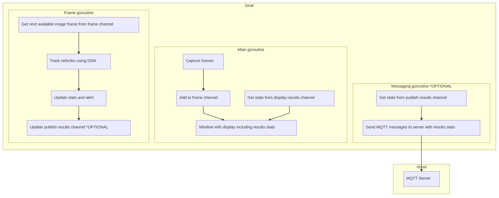

# Parking Lot Counter

| Details            |              |
|-----------------------|---------------|
| Target OS:            |  Ubuntu\* 16.04 LTS   |
| Programming Language: |  Google Go* programming language |
| Time to Complete:     |  45 min     |


## Introduction

This parking lot counter application is one of a series of reference implementations for Computer Vision (CV) using the Intel® Distribution of OpenVINO™ toolkit written in the Go* programming language. This application is designed for a parking space area mounted camera which counts available parking space by tracking the number of vehicles entering and leaving the parking space area.

## Requirements

### Hardware

* 6th Generation Intel® Core™ processor with Intel® Iris® Pro graphics and Intel® HD Graphics

### Software

* [Ubuntu\* 16.04 LTS](http://releases.ubuntu.com/16.04/)
*Note*: You must be running kernel version 4.7+ to use this software. We recommend using a 4.14+ kernel to use this software. Run the following command to determine your kernel version:

```shell
uname -a
```

* OpenCL™ Runtime Package
* Intel® Distribution of OpenVINO™ toolkit
* Go programming language v1.11+

## Setup

### InstallIntel® Distribution of OpenVINO™ toolkit

Refer to [Install the Intel® Distribution of OpenVINO™ toolkit for Linux*](https://software.intel.com/en-us/articles/OpenVINO-Install-Linux) for more information about how to install and setup the Intel® Distribution of OpenVINO™ toolkit.

The software requires the installation of OpenCL™ Runtime package to run inference on the GPU, as indicated in the following instructions. It is not mandatory for CPU inference.

### Install Go

Install the Go programming language version 1.11+ in order to compile this application. Obtain the latest compiler from the Go website's [download page.](https://golang.org/dl/)

For an excellent introduction to the Go programming language, see the [online tour.](https://tour.golang.org)

### Download the Reference Platform Code

Download the reference platform code onto your computer by using the "go get" command:

```shell
go get -d github.com/intel-iot-devkit/parking-lot-counter-go
```

Change the current directory to the location where the application code is installed: 

```shell
cd $GOPATH/src/github.com/intel-iot-devkit/parking-lot-counter-go
```

### Install Dependency Tool

This sample uses the `dep` dependency tool for Go. Download and install the tool:

```shell
make godep

```

### Install GoCV

After installing Go, install the [GoCV package](https://gocv.io/) which contains the Go programming language wrappers for Intel® Distribution of OpenVINO™ toolkit and the associated dependencies. The `dep` tool satisfies the program's dependencies as defined in `Gopkg.lock` file. To run, use:

```shell
make dep
```

Now you should be ready to build and run the reference platform application code.

## How It Works

The application uses a video source, such as a camera, to grab frames, and then uses a Deep Neural Network (DNNs) to process the data. The network detects vehicles in the frame, and then if successful it tracks the vehicles leaving and entering the parking area adjusting the counts of the vehicles in the parking area thus providing the information about the available parking spaces.

The data can then optionally be sent to a MQTT machine to machine messaging server, as part of a parking space data analytics system.

This application users DNN models optimized for Intel® architecture. These models are part of the Intel® Distribution of OpenVINO™ toolkit.

Find it here:

- `/opt/intel/computer_vision_sdk/deployment_tools/intel_models/pedestrian-and-vehicle-detector-adas-0001`



The program creates three goroutines for concurrency:

- Main goroutine that performs the video i/o
- Worker goroutine that processes video frames
- Worker goroutine that publishes MQTT messages to remote server

## Set the Build Environment

Configure the environment to use the Intel® Distribution of OpenVINO™ toolkit one time per session:

```shell
source /opt/intel/computer_vision_sdk/bin/setupvars.sh
```

## Build the Code

Change the current directory to the location of the git-cloned application code. For example:

```shell
cd $GOPATH/src/github.com/intel-iot-devkit/parking-lot-counter-go
```

Before building the program, obtain its dependencies by running the commands below. The first one fetches `Go` depedency manager of our choice and the second uses it to satisfy the program's depdencies as defined in `Gopkg.lock` file:

```shell
make godep
make dep
```

After fetching dependencies, export a few environment variables required to build the library from the fetched dependencies. Run the  source command from the project directory:

```shell
source vendor/gocv.io/x/gocv/openvino/env.sh
```

To build the program binary, the project ships a simple `Makefile`. Invoke the `build` task from the project root as follows:

```shell
make build
```

This command creates a new directory called `build` in your current working directory and places the newly built binary called `counter` into it. Once the commands are finished, you should have built the `counter` application executable.

## Run the Code

To see a list of the various options:

```shell
./counter -help
```

To run the application with the needed model using the webcam:

```shell
./counter -model=/opt/intel/computer_vision_sdk/deployment_tools/intel_models/pedestrian-and-vehicle-detector-adas-0001/FP32/pedestrian-and-vehicle-detector-adas-0001.bin -model-config=/opt/intel/computer_vision_sdk/deployment_tools/intel_models/pedestrian-and-vehicle-detector-adas-0001/FP32/pedestrian-and-vehicle-detector-adas-0001.xml
```

To control the position of the parking entrance/exit, use the `-entrance, -e` command line flag, like this:

```shell
./counter -model=/opt/intel/computer_vision_sdk/deployment_tools/intel_models/pedestrian-and-vehicle-detector-adas-0001/FP32/pedestrian-and-vehicle-detector-adas-0001.bin -model-config=/opt/intel/computer_vision_sdk/deployment_tools/intel_models/pedestrian-and-vehicle-detector-adas-0001/FP32/pedestrian-and-vehicle-detector-adas-0001.xml -entrance="b"
```

The `-entrance` flag controls which part of the video stream frame is to be used for counting the cars entering and exiting the parking lot:

* `"b"`: bottom
* `"l"`: left
* `"r"`: right
* `"t"`: top

To control the car detection DNN confidence level use the `-model-confidence` flag (e.g., `-model-confidence=0.6` will track all cars whose DNN detection confidence level is higher than `60%`).

The calculations made to track movement using centroids have two parameters that can be set via flags. The`-max-dist` flag sets the maximum distance, the size of distance of movement between frames before assuming the object is a different vehicle, in pixels between two related centroids. The`-max-gone` flag sets the maximum number of frames to track a centroid which doesn't change, possibly due to being a parked vehicle.

Use the erode filter flag, `-filter=true`,to perform image cleanup before the DNN processing takes place. 

### Hardware Acceleration

This application can take advantage of the hardware acceleration in the Intel® Distribution of OpenVINO™ toolkit by using the `-backend` and `-target` parameters.

For example, to use the Intel® Distribution of OpenVINO™ toolkit backend with the GPU in 32-bit mode:

```shell
./counter -model=/opt/intel/computer_vision_sdk/deployment_tools/intel_models/pedestrian-and-vehicle-detector-adas-0001/FP32/pedestrian-and-vehicle-detector-adas-0001.bin -model-config=/opt/intel/computer_vision_sdk/deployment_tools/intel_models/pedestrian-and-vehicle-detector-adas-0001/FP32/pedestrian-and-vehicle-detector-adas-0001.xml -backend=2 -target=1
```

To run the code using 16-bit floats, set the `-t` flag to use the GPU in 16-bit mode, as well as use the FP16 version of the Intel® models:

```shell
./counter -model=/opt/intel/computer_vision_sdk/deployment_tools/intel_models/pedestrian-and-vehicle-detector-adas-0001/FP16/pedestrian-and-vehicle-detector-adas-0001.bin -model-config=/opt/intel/computer_vision_sdk/deployment_tools/intel_models/pedestrian-and-vehicle-detector-adas-0001/FP16/pedestrian-and-vehicle-detector-adas-0001.xml -backend=2 -target=2
```

To run the code using the VPU, you have to set the `-target` flag to `3` and also use the 16-bit FP16 version of the Intel® models:

```shell
./counter -model=/opt/intel/computer_vision_sdk/deployment_tools/intel_models/pedestrian-and-vehicle-detector-adas-0001/FP16/pedestrian-and-vehicle-detector-adas-0001.bin -model-config=/opt/intel/computer_vision_sdk/deployment_tools/intel_models/pedestrian-and-vehicle-detector-adas-0001/FP16/pedestrian-and-vehicle-detector-adas-0001.xml -backend=2 -target=3
```

## Sample Videos

There are several sample videos that can be used to demonstrate the capabilities of this application. Download them by running these commands from the `parking-lot-counter-go` directory:

```shell
mkdir resources
cd resources
wget https://github.com/intel-iot-devkit/sample-videos/raw/master/car-detection.mp4
cd ..
```

To then execute the code using one of these sample videos, run the following commands from the `parking-lot-counter-go` directory:

```shell
cd build
./counter -model=/opt/intel/computer_vision_sdk/deployment_tools/intel_models/pedestrian-and-vehicle-detector-adas-0001/FP32/pedestrian-and-vehicle-detector-adas-0001.bin -model-config=/opt/intel/computer_vision_sdk/deployment_tools/intel_models/pedestrian-and-vehicle-detector-adas-0001/FP32/pedestrian-and-vehicle-detector-adas-0001.xml -backend=2 -target=1 -input=../resources/car-detection.mp4 -entrance="t" -model-confidence=0.7 -filter=true
```

The above command will use the top edge of the video stream frame as parking lot entrance and will count the cars driving up the frame as the cars entering the parking lot and the cars driving down the frame as the cars leaving the parking lot. It also uses the `-filter=true` to enable the erode filter on the video images before processing. The application displays in real time how many cars have entered and exited the parking lot.

## Machine to Machine Messaging with MQTT

If you wish to use a MQTT server to publish data, set the following environment variables before running the program:

```shell
export MQTT_SERVER=tcp://localhost:1883
export MQTT_CLIENT_ID=parking123
```

*Note:* You must always specify the server protocol -- the above example is using `TCP` protocol.

Change the `MQTT_SERVER` to a value that matches the MQTT server you are connecting to.

You should change the `MQTT_CLIENT_ID` to a unique value for each monitoring station, so you can track the data for individual locations. For example:

```shell
export MQTT_CLIENT_ID=parking123
```

If you want to monitor the MQTT messages sent to your local server, and you have the `mosquitto` client utilities installed, you can run the following command:

```shell
mosquitto_sub -t 'parking/counter'
```

## Docker*

To use the reference implementatino with Docker*, build a Docker image and then run the program in a Docker container. Use the `Dockerfile` present in the cloned repository to build the Docker image.

Follow the registration process for the Intel® Distribution of OpenVINO™ toolkit to obtain a unique download URL. A registration email  will be sent. It contains a link to the Intel Registration Center website download page, shown here:


Navigate to the download page using the link. On the download page, use the "Choose Product to Download" selection box and select "Intel® Distribution of OpenVINO™ toolkit for Linux*". Next, using the "Choose a Version" selection box, select "2018 R5". The "Choose a Download Option" section should appear. Right click on the button "Full Package" and choose "Copy Link Address". The clipboard should now contain a unique download URL. Save this URL somewhere safe.


Now build a unique Docker image by running the following command, substituting the actual URL obtained in the previous step:

```shell
docker build -t parking-lot-counter-go --build-arg OPENVINO_DOWNLOAD_URL=[your unique OpenVINO download URL here] .
```

This will produce a docker image called `parking-lot-counter-go` which contains the built binary. Since the built docker image has an [ENTRYPOINT](https://docs.docker.com/engine/reference/builder/#entrypoint) defined you can run the image as an executable using the following command:

```shell
docker run -it --rm parking-lot-counter-go -h
```

To run the Docker image on an Ubuntu host machine using an attached camera, use:

```shell
xhost +local:docker
docker run --device=/dev/video0:/dev/video0 -v /tmp/.X11-unix:/tmp/.X11-unix -e DISPLAY=$DISPLAY -it --rm parking-lot-counter-go -model=/opt/intel/computer_vision_sdk/deployment_tools/intel_models/pedestrian-and-vehicle-detector-adas-0001/FP32/pedestrian-and-vehicle-detector-adas-0001.bin -model-config=/opt/intel/computer_vision_sdk/deployment_tools/intel_models/pedestrian-and-vehicle-detector-adas-0001/FP32/pedestrian-and-vehicle-detector-adas-0001.xml
xhost -local:docker
```

To run the Docker image on an Ubuntu host machine using a file input, use:

```shell
xhost +local:docker
docker run -v ${PWD}/resources:/resources -v /tmp/.X11-unix:/tmp/.X11-unix -e DISPLAY=$DISPLAY -it --rm parking-lot-counter-go -model=/opt/intel/computer_vision_sdk/deployment_tools/intel_models/pedestrian-and-vehicle-detector-adas-0001/FP32/pedestrian-and-vehicle-detector-adas-0001.bin -model-config=/opt/intel/computer_vision_sdk/deployment_tools/intel_models/pedestrian-and-vehicle-detector-adas-0001/FP32/pedestrian-and-vehicle-detector-adas-0001.xml -input=/resources/car-detection.mp4 -entrance="b" -model-confidence=0.65
xhost -local:docker
```

## Microsoft Azure*

To take advantage of a more advanced build system provided by [Microsoft Azure Cloud](https://azure.microsoft.com/), see the Azure guide [here](./azure.md). Following the steps in the guide to build a Docker container and push it into Azure Container Registry to make it available online.

## Related Reference Implementations
[Parking Lot Counter CPP](https://github.com/intel-iot-devkit/parking-lot-counter-cpp)
